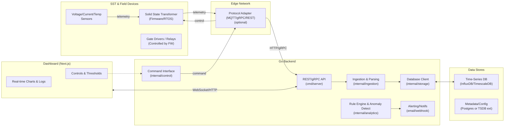
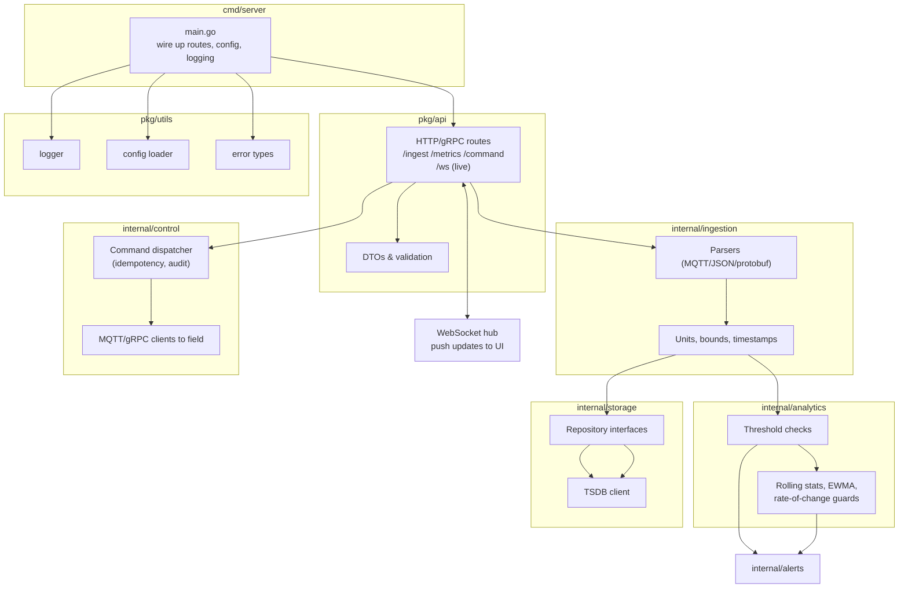
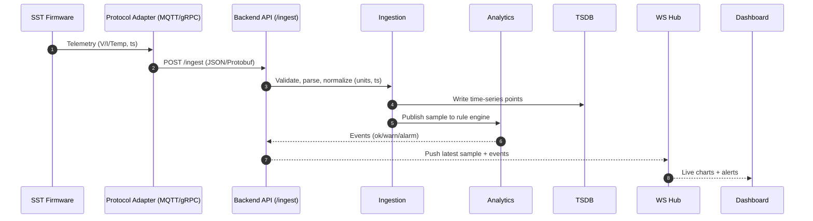
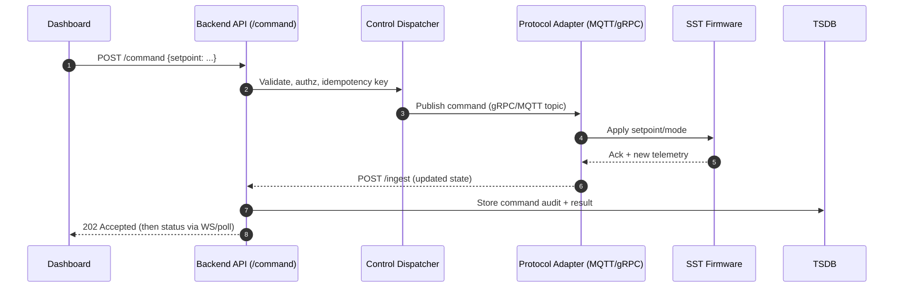

How to Read This Doc

Top half = quick map.
Skim the Problem, Goals, Components, Interfaces, Data Model to remind me what this system is about

Bottom half = detailed blueprint.
When needed specifics: diagrams, flows, or backend component breakdowns. This is the “how it really works” section.

Use with glossary.
New terms I come across check docs/glossary.md for a definition.

Update as you build.

Add to Interfaces when you finalize a new API.

Adjust Data Model when schema changes.

Mark open questions as resolved.

Purpose: Map so I don’t feel lost when juggling backend, dashboard, and MQTT all at once.

# Architecture — SST Edge Monitoring & Control

## 1) Problem & Goals

- Ingest SST telemetry, visualize it, alert on thresholds, and send control commands safely.

## 2) Non-Goals (for now)

- No real power switching control; device is simulated.
- No multi-tenant auth; use simple API keys.

## 3) System Overview

Device → Backend (/ingest) → TSDB → Analytics → Alerts → UI, and UI → Backend (/command) → Device (via MQTT).

## 4) Components

- **Backend (Go):** ingestion, analytics, control, storage.
- **Dashboard (Next.js):** charts, alerts, controls.
- **TSDB (TimescaleDB or InfluxDB):** telemetry storage.
- **MQTT broker:** southbound messaging.
- **Device simulator:** publishes telemetry, applies commands.

## 5) Interfaces

- **REST:**

  - POST /ingest (telemetry payload)
  - GET /metrics (query window)
  - POST /command (setpoints/modes, idempotency key)

- **WebSocket:** /ws (push latest samples + alerts)
- **MQTT topics:**

  - sst/{deviceId}/telemetry
  - sst/{deviceId}/command

## 6) Data Model

- telemetry(device_id, ts, voltage, current, temperature)
- alerts(id, device_id, ts, type, value, threshold)
- commands(id, device_id, ts, type, payload, status, idem_key)

## 7) Operations

- **Logging:** structured (request_id, device_id)
- **Metrics:** Prometheus counters for requests/errors
- **Reliability:** retries with backoff; idempotent commands

## 8) Open Questions

- TimescaleDB vs InfluxDB?
- WebSockets vs SSE for UI updates?

---

# Detailed Diagrams & Flows

## 1) High-Level System

## 2) Backend Components (Go)

## 3) Telemetry Ingest — Sequence

## 4) Control Command — Sequence

